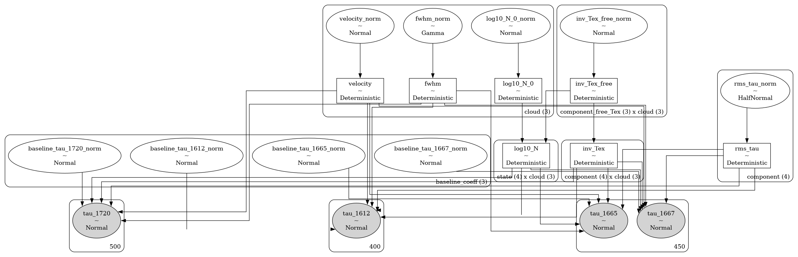
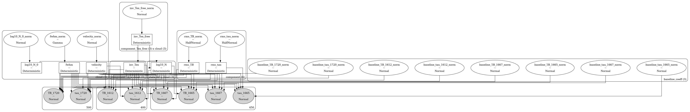

# amoeba2 <!-- omit in toc -->


[](https://amoeba2.readthedocs.io/en/latest/?badge=latest)
[](https://codecov.io/gh/tvwenger/amoeba2)

Automated Molecular Excitation Bayesian line-fitting Algorithm

`amoeba2` is a Bayesian model of the 1612, 1665, 1667, and 1720 MHz hyperfine transitions of OH written in the [`bayes_spec`](https://github.com/tvwenger/bayes_spec) spectral line modeling framework. `amoeba2` is inspired by [AMOEBA](https://github.com/AnitaPetzler/AMOEBA) and [Petzler et al. (2021)](https://iopscience.iop.org/article/10.3847/1538-4357/ac2f42).

Read below to get started, and check out the tutorials here: https://amoeba2.readthedocs.io

- [Installation](#installation)
  - [Basic Installation](#basic-installation)
  - [Development Installation](#development-installation)
- [Notes on Physics \& Radiative Transfer](#notes-on-physics--radiative-transfer)
- [Models](#models)
  - [`TauModel`](#taumodel)
  - [`TauTBModel`](#tautbmodel)
  - [`ordered`](#ordered)
- [Syntax \& Examples](#syntax--examples)
- [Issues and Contributing](#issues-and-contributing)
- [License and Copyright](#license-and-copyright)


# Installation

## Basic Installation

Install with `pip` in a `conda` virtual environment:
```
conda create --name amoeba2 -c conda-forge pymc pip
conda activate amoeba2
pip install amoeba2
```

## Development Installation

Alternatively, download and unpack the [latest release](https://github.com/tvwenger/amoeba2/releases/latest), or [fork the repository](https://docs.github.com/en/pull-requests/collaborating-with-pull-requests/working-with-forks/fork-a-repo) and contribute to the development of `amoeba2`!

Install in a `conda` virtual environment:
```
cd /path/to/amoeba2
conda env create -f environment.yml
conda activate amoeba2-dev
pip install -e .
```

# Notes on Physics & Radiative Transfer

All models in `amoeba2` apply the same physics and equations of radiative transfer. 

The transition optical depth is taken from [Magnum & Shirley (2015) equation 29](https://ui.adsabs.harvard.edu/abs/2015PASP..127..266M/abstract). The excitation temperature is allowed to vary between transitions (a non-LTE assumption) and clouds. The excitation temperatures of the 1612, 1665, and 1667 MHz transitions are free, whereas that of the 1720 MHz transition is derived from the excitation temperature sum rule.

The radiative transfer is calculated explicitly assuming an off-source background temperature `bg_temp` (see below) similar to [Magnum & Shirley (2015) equation 23](https://ui.adsabs.harvard.edu/abs/2015PASP..127..266M/abstract). By default, the clouds are ordered from *nearest* to *farthest*, so optical depth effects (i.e., self-absorption) may be present.

Notably, since these are *forward models*, we do not make assumptions regarding the optical depth or the Rayleigh-Jeans limit. These effects are *predicted* by the model. There is one exception: the `ordered` argument, [described below](#ordered).

# Models

The models provided by `amoeba2` are implemented in the [`bayes_spec`](https://github.com/tvwenger/bayes_spec) framework. `bayes_spec` assumes that the source of spectral line emission can be decomposed into a series of "clouds", each of which is defined by a set of model parameters. Here we define the models available in `amoeba2`.

## `TauModel`

`TauModel` is a model that predicts the OH hyperfine optical depth spectra, typically measured via absorption observations. The `SpecData` keys for this model must be "tau_1612", "tau_1665", "tau_1667", and "tau_1720". The following diagram demonstrates the relationship between the free parameters (empty ellipses), deterministic quantities (rectangles), model predictions (filled ellipses), and observations (filled, round rectangles). Many of the parameters are internally normalized (and thus have names like `_norm`). The subsequent tables describe the model parameters in more detail.



| Cloud Parameter<br>`variable` | Parameter                                | Units    | Prior, where<br>($p_0, p_1, \dots$) = `prior_{variable}`     | Default<br>`prior_{variable}` |
| :---------------------------- | :--------------------------------------- | :------- | :----------------------------------------------------------- | :---------------------------- |
| `log10_N_0`                   | log10 lowest energy state column density | `cm-2`   | $\log_{10}N_0 \sim {\rm Normal}(\mu=p_0, \sigma=p_1)$        | `[13.0, 1.0]`                 |
| `inv_Tex`                     | Inverse excitation temperature           | `K-1`    | $T_{\rm ex}^{-1} \sim {\rm Normal}(\mu=p_0, \sigma=p_1)$     | `[0.1, 1.0]`                  |
| `fwhm`                        | FWHM line width                          | `km s-1` | $\Delta V_{\rm H} \sim {\rm Gamma}(\alpha=2.0, \beta=1.0/p)$ | `1.0`                         |  |
| `velocity`                    | Velocity                                 | `km s-1` | $V \sim {\rm Normal}(\mu=p_0, \sigma=p_1)$                   | `[0.0, 10.0]`                 |

| Hyper Parameter<br>`variable` | Parameter               | Units | Prior, where<br>($p_0, p_1, \dots$) = `prior_{variable}` | Default<br>`prior_{variable}` |
| :---------------------------- | :---------------------- | :---- | :------------------------------------------------------- | :---------------------------- |
| `rms_tau`                     | Optical depth rms noise | ``    | ${\rm rms}_\tau \sim {\rm HalfNormal}(\sigma=p)$         | `0.1`                         |

## `TauTBModel`

`TauTBModel` is otherwise identical to `TBModel`, except it also predicts the brightness temperature spectra assuming a given background source brightness temperature (where `bg_temp` is in `K` and is supplied during model initialization `TBTauModel(bg_temp=2.7)`). The `SpecData` keys for this model must be "tau_1612", "tau_1665", "tau_1667", "tau_1720", "TB_1612", "TB_1665", "TB_1667", and "TB_1720". The following diagram demonstrates the model, and the subsequent table describe the additional model parameters.



| Hyper Parameter<br>`variable` | Parameter                                 | Units | Prior, where<br>($p_0, p_1, \dots$) = `prior_{variable}` | Default<br>`prior_{variable}` |
| :---------------------------- | :---------------------------------------- | :---- | :------------------------------------------------------- | :---------------------------- |
| `rms_TB`                      | Brightness temperature spectral rms noise | ``    | ${\rm rms}_{T} \sim {\rm HalfNormal}(\sigma=p)$          | `1.0`                         |


## `ordered`

An additional parameter to `set_priors` for these models is `ordered`. By default, this parameter is `False`, in which case the order of the clouds is from *nearest* to *farthest*. Sampling from these models can be challenging due to the labeling degeneracy: if the order of clouds does not matter (i.e., the emission is optically thin), then each Markov chain could decide on a different, equally-valid order of clouds.

If we assume that the emission is optically thin, then we can set `ordered=True`, in which case the order of clouds is restricted to be increasing with velocity. This assumption can *drastically* improve sampling efficiency. When `ordered=True`, the `velocity` prior is defined differently:

| Cloud Parameter<br>`variable` | Parameter | Units    | Prior, where<br>($p_0, p_1, \dots$) = `prior_{variable}`                 | Default<br>`prior_{variable}` |
| :---------------------------- | :-------- | :------- | :----------------------------------------------------------------------- | :---------------------------- |
| `velocity`                    | Velocity  | `km s-1` | $V_i \sim p_0 + \sum_0^{i-1} V_i + {\rm Gamma}(\alpha=2, \beta=1.0/p_1)$ | `[0.0, 1.0]`                  |

# Syntax & Examples

See the various tutorial notebooks under [docs/source/notebooks](https://github.com/tvwenger/amoeba2/tree/main/docs/source/notebooks). Tutorials and the full API are available here: https://amoeba2.readthedocs.io.

# Issues and Contributing

Anyone is welcome to submit issues or contribute to the development of this software via [Github](https://github.com/tvwenger/amoeba2).

# License and Copyright

Copyright (c) 2024 Trey Wenger

GNU General Public License v3 (GNU GPLv3)

This program is free software: you can redistribute it and/or modify
it under the terms of the GNU General Public License as published
by the Free Software Foundation, either version 3 of the License,
or (at your option) any later version.

This program is distributed in the hope that it will be useful,
but WITHOUT ANY WARRANTY; without even the implied warranty of
MERCHANTABILITY or FITNESS FOR A PARTICULAR PURPOSE.  See the
GNU General Public License for more details.

You should have received a copy of the GNU General Public License
along with this program.  If not, see <http://www.gnu.org/licenses/>.